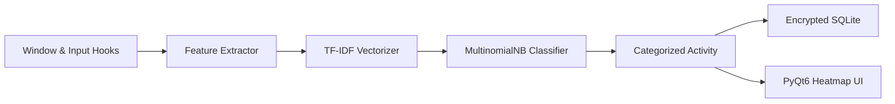

## System Architecture

The AI Work Assistant is engineered for modern developers and remote professionals seeking granular activity telemetry without compromising privacy.

A non-intrusive background daemon tracks active window transitions, title strings, and active input cadence using cross-platform hooks (`psutil` and `pywin32`). Telemetry events feed into a local SQLite database encrypted with SQLCipher/AES.

An offline ML categorization pipeline classifies activities into **Focus**, **Communication**, **Research**, or **Idle** states, rendering interactive productivity heatmaps via PyQt6 and presenting context-aware task recommendations.

## Offline Machine Learning Pipeline



## Activity Capture & Classification

### Scikit-Learn Pipeline & Text Classifier

```python
import sqlite3
from sklearn.pipeline import Pipeline
from sklearn.feature_extraction.text import TfidfVectorizer
from sklearn.naive_bayes import MultinomialNB

class ActivityClassifier:
    """Local offline machine learning classifier for window titles."""
    def __init__(self, model_path: str):
        self.pipeline = Pipeline([
            ('tfidf', TfidfVectorizer(ngram_range=(1, 2), max_features=5000)),
            ('clf', MultinomialNB(alpha=0.1))
        ])

    def predict_category(self, window_title: str) -> str:
        if not window_title or len(window_title.strip()) == 0:
            return "IDLE"
        # Zero-latency local inference on user device
        return self.pipeline.predict([window_title])[0]
```

### psutil Window Telemetry & System Tray

```python
import psutil
from PyQt6.QtWidgets import QSystemTrayIcon, QMenu
from PyQt6.QtGui import QIcon

class WorkAssistantTray(QSystemTrayIcon):
    """System tray daemon tracking active processes and cadence."""
    def __init__(self, app_context):
        super().__init__(QIcon("assets/icon.png"), app_context)
        self.menu = QMenu()
        self.dashboard_action = self.menu.addAction("Open Productivity Dashboard")
        self.pause_action = self.menu.addAction("Pause Telemetry")
        self.quit_action = self.menu.addAction("Exit Assistant")
        self.setContextMenu(self.menu)

    def sample_active_window(self):
        # Cross-platform process telemetry sampling
        for proc in psutil.process_iter(['pid', 'name', 'status']):
            if proc.info['status'] == psutil.STATUS_RUNNING:
                yield proc.info['name']
```

## AI/ML Model Parameters

| Parameter | Type | Default | Description |
| :--- | :--- | :--- | :--- |
| `Feature Extractor` | TfidfVectorizer | `ngram (1,2), max 5000` | Extracts sub-word and token n-grams from window titles. |
| `Classifier Model` | MultinomialNB | `alpha=0.1` | Lightweight Naive Bayes classifier providing sub-5ms CPU predictions. |
| `Sampling Cadence` | duration | `2000ms` | Interval between foreground window and input activity polling cycles. |
| `Model Persistence` | joblib | `classifier.joblib` | Serializes adapted model states locally after continuous learning runs. |

## Official Repositories & Artifacts

- [AI Work Assistant on GitHub](https://github.com/maurihimanshu/ai_work_assistant)
