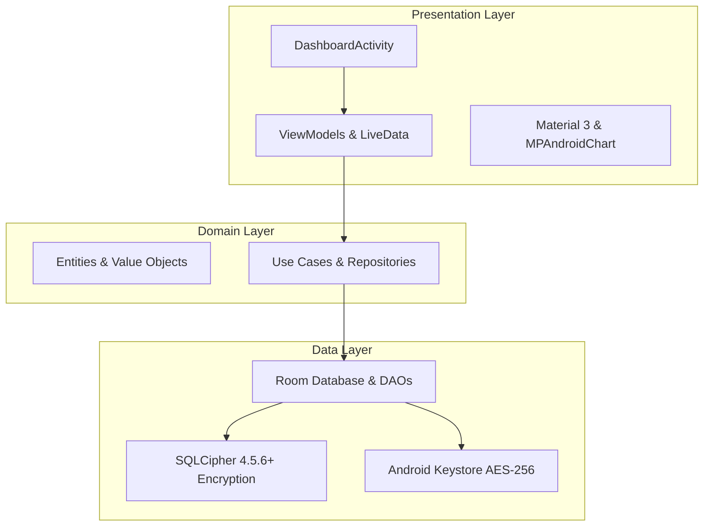

## Overview & Design Philosophy

Expenso is a comprehensive personal finance application engineered around complete data sovereignty and zero cloud telemetry. Unlike traditional cloud-connected budgeting apps, all records stay strictly on the user device.

The architecture enforces Clean Architecture principles across three distinct boundaries:
- **Presentation Layer**: Activity-based navigation (`DashboardActivity`, `TransactionsActivity`, `BudgetsActivity`, `AnalyticsActivity`, `SettingsActivity`), ViewModels, LiveData, Material Design 3, MPAndroidChart visualizations, and iText7 PDF exports.
- **Domain Layer**: Entities, business Use Cases, and Repository interfaces.
- **Data Layer**: Room ORM, SQLCipher 4.5.6+ on-disk page encryption, and EncryptedSharedPreferences.

Security is multi-layered: hardware-backed Android Keystore generates non-exportable AES-256-GCM keys, BiometricPrompt gates entry with PIN fallback, Argon2 hashes credentials, and runtime sentinels detect root, debugger attachment, and emulators.

## Clean Architecture Layers



## SQLCipher & Security Implementation

### SQLCipher Encrypted Room Database

```java
@Database(
  entities = {TransactionEntity.class, BudgetEntity.class, CategoryEntity.class},
  version = 1,
  exportSchema = true
)
public abstract class AppDatabase extends RoomDatabase {

  public abstract TransactionDao transactionDao();
  public abstract BudgetDao budgetDao();

  public static AppDatabase getInstance(Context context, byte[] passphrase) {
    final SupportFactory factory = new SupportFactory(passphrase);
    return Room.databaseBuilder(context.getApplicationContext(), AppDatabase.class, "expenso_secure.db")
      .openHelperFactory(factory)
      .fallbackToDestructiveMigration()
      .build();
  }
}
```

### Android Keystore & Biometric Cipher

```java
public class KeyStoreManager {

  private static final String KEY_ALIAS = "ExpensoMasterKey";
  private static final String ANDROID_KEY_STORE = "AndroidKeyStore";

  public static Cipher createBiometricCipher() throws Exception {
    KeyStore keyStore = KeyStore.getInstance(ANDROID_KEY_STORE);
    keyStore.load(null);

    if (!keyStore.containsAlias(KEY_ALIAS)) {
      KeyGenerator keyGenerator = KeyGenerator.getInstance(
        KeyProperties.KEY_ALGORITHM_AES, ANDROID_KEY_STORE
      );
      keyGenerator.init(new KeyGenParameterSpec.Builder(
        KEY_ALIAS,
        KeyProperties.PURPOSE_ENCRYPT | KeyProperties.PURPOSE_DECRYPT
      )
      .setBlockModes(KeyProperties.BLOCK_MODE_GCM)
      .setEncryptionPaddings(KeyProperties.ENCRYPTION_PADDING_NONE)
      .setUserAuthenticationRequired(true)
      .build());
      keyGenerator.generateKey();
    }

    SecretKey secretKey = (SecretKey) keyStore.getKey(KEY_ALIAS, null);
    Cipher cipher = Cipher.getInstance("AES/GCM/NoPadding");
    cipher.init(Cipher.ENCRYPT_MODE, secretKey);
    return cipher;
  }
}
```

## Security & Performance Specifications

| Parameter | Type | Default | Description |
| :--- | :--- | :--- | :--- |
| `Database Cipher` | AES-256 (CBC) | `SQLCipher 4.5.6+` | Full on-disk page encryption across all Room SQLite tables. |
| `Key Derivation` | PBKDF2WithHmacSHA1 | `64,000 iterations` | Derives cryptographic master database keys from user credentials. |
| `Hardware Storage` | Android Keystore | `Hardware TEE / StrongBox` | Key material is non-exportable and protected from application memory dumps. |
| `Runtime Defense` | Threat Detection | `Root, Debug, Emulator` | Proactively prevents execution under compromised, rooted, or hooked environments. |
| `Encrypted Backups` | WorkManager Daemon | `Scheduled AES Export` | Encrypted JSON export allowing manual or automated local backup restoration. |

## Official Repositories & Store Links

- [View Expenso on Google Play Store](https://play.google.com/store/apps/details?id=com.offline.expenso)
- [Expenso Architecture Docs on GitHub](https://github.com/maurihimanshu/expenso-docs)
