## Optical Protocol Architecture

Standard QR transfers fail frequently because camera-based receivers drop frames due to lighting changes, camera motion blur, or frame synchronization mismatch.

The **RQFT (Reliable QR File Transfer)** protocol solves this by dividing compressed files into sequenced frames with an envelope structure:

```text
["RQFT", version, frameType, transferId, payload]
```

- `M` (Manifest): File metadata, total expected chunks, compression type, and original SHA-256 hash.
- `D` (Data chunk): Base64-encoded compressed byte payload with sequence index.
- `E` (End marker): Stream completion signal.

The sender streams all chunks in continuous cyclic rounds. The receiver maintains a sparse map of `sequence -> payload`, so duplicate frames are idempotent and harmless.

## Reassembly & Verification Lifecycle

A transfer is finalized only when all 4 conditions are met:
1. Every expected sequence index exists in the receiver buffer.
2. The compressed byte stream is reconstructed in strict sequence order.
3. The stream is decompressed successfully.
4. The cryptographic SHA-256 hash of the decompressed payload strictly equals the manifest digest.

## Protocol Framing Implementation

### TypeScript RQFT Frame Reassembler

```typescript
export interface RqftFrame {
  type: 'M' | 'D' | 'E'; // Manifest, Data, End
  transferId: string;
  seq?: number;
  totalChunks?: number;
  expectedSha256?: string;
  dataChunk?: string; // base64 payload
}

export class RqftReceiver {
  private chunks = new Map<number, Uint8Array>();
  private manifest: RqftFrame | null = null;

  public ingestFrame(frame: RqftFrame): boolean {
    if (frame.type === 'M') {
      this.manifest = frame;
      return false;
    }
    if (frame.type === 'D' && frame.seq !== undefined && frame.dataChunk) {
      this.chunks.set(frame.seq, decodeBase64(frame.dataChunk));
    }
    return this.isComplete();
  }

  public isComplete(): boolean {
    if (!this.manifest || !this.manifest.totalChunks) return false;
    return this.chunks.size === this.manifest.totalChunks;
  }
}
```

### TypeScript RQFT Stream Producer

```typescript
export class RqftProducer {
  private chunks: string[] = [];
  private currentIdx = 0;

  constructor(
    public readonly transferId: string,
    public readonly rawBytes: Uint8Array,
    public readonly sha256Hex: string,
    public readonly chunkSize = 450
  ) {
    this.prepareChunks();
  }

  private prepareChunks(): void {
    const total = Math.ceil(this.rawBytes.length / this.chunkSize);
    for (let i = 0; i < total; i++) {
      const slice = this.rawBytes.slice(i * this.chunkSize, (i + 1) * this.chunkSize);
      this.chunks.push(encodeBase64(slice));
    }
  }

  public getNextFrame(): string {
    const payload = this.chunks[this.currentIdx];
    const frame = ["RQFT", 1, "D", this.transferId, { seq: this.currentIdx, dataChunk: payload }];
    this.currentIdx = (this.currentIdx + 1) % this.chunks.length; // Cyclic streaming
    return JSON.stringify(frame);
  }
}
```

## Optical Transmission Pipeline

```mermaid
flowchart LR
  File[Source Binary File] --> Chunks[SHA-256 Chunks]
  Chunks --> Envelope[RQFT Frame Envelope]
  Envelope --> Stream[Cyclic Animated QR Stream]
  Stream -.->|Optical Line of Sight| Camera[Receiver Webcam]
  Camera --> Matrix[Buffer & Reassembly Matrix]
  Matrix --> Hash[SHA-256 Digest Verification]
  Hash --> Output[Restored Binary File]
```



## Optical Frame Configuration Parameters

| Parameter | Type | Default | Description |
| :--- | :--- | :--- | :--- |
| `frameIntervalMs` | integer | `160ms` | Delay between consecutive QR frames displayed on sender screen (140–200ms). |
| `chunkSizeBytes` | integer | `450` | Payload byte limit per QR code optimized for standard webcams. |
| `verificationHash` | algorithm | `SHA-256` | Cryptographic digest verified against reassembled payload. |
| `frameEnvelope` | JSON Array | `["RQFT", 1, type, id, payload]` | Structured header envelope containing protocol version and frame type. |

## Official Repositories & Artifacts

- [Reliable QR File Transfer on GitHub](https://github.com/maurihimanshu/Reliable-QR-File-Transfer)
